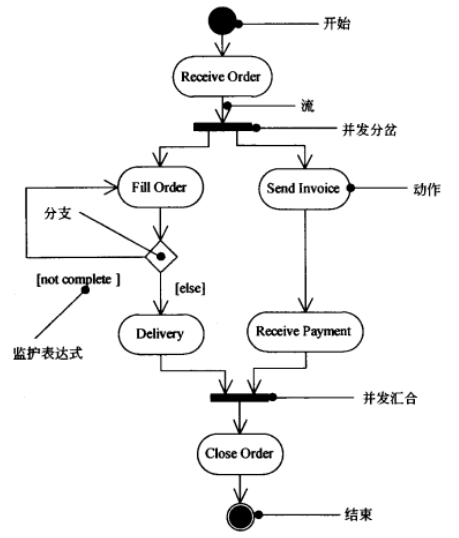
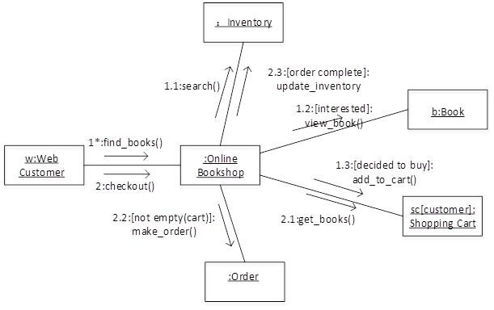
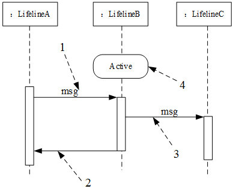
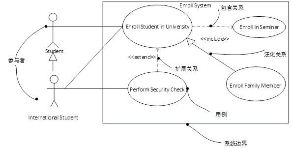
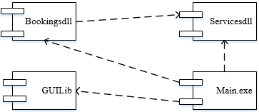

# 面向对象技术

## 面向对象的基本概念

* **对象 :** 属性(数据) + 方法(操作) + 对象ID
* **类 :** 实体类(数据),控制类(类之间协调),边界类(对外接口)
* **继承与泛化 :** 复用机制
* **封装 :** 隐藏对象的属性和实现细节,仅对外公开接口
* **多态 :** 不同对象收到 **同样的信息** 产生不同的结果
* **接口 :** 一种特殊的类,他只有方法定义没有实现
* **重载 :** 一个类可以有多个 **同名而参数类型不同的方法**
* **模板类**
* **消息和消息通信 :** 消息是异步通信的

## 面向对象设计7大原则
* **单一职责原则 :** 设计目的单一的类
* **开放-封闭原则 :** 对扩展开放，对修改封闭
* **李氏(Liskov)替换原则 :** 子类可以替换父类
* **依赖倒置原则 :** 要依赖于抽象，而不是具体实现;针对接口编程，不要针对实现编程
* **接口隔离原则 :** 使用多个专门的接口比使用单一的总接口要好
* ~~**组合重用原则 :** 要尽量使用组合，而不是继承关系达到重用目的~~
* **迪米特(Demeter)原则(最少知识法则) :** 一个对象应当对其他对象有尽可能少的了解

## UML

* UML **多重度** ：一个类的实例能与另一个类的多少个实例关联

|                |                      |                                                        |
| -------------- | -------------------- | ------------------------------------------------------ |
| 结构图(静态图) | 类图                 | /                                                      |
| ^              | 对象图               | /                                                      |
| ^              | 包图*                | /                                                      |
| ^              | 聚合结构图*          | /                                                      |
| ^              | 构建图               | /                                                      |
| ^              | **部署图**           | 软硬件之间的映射                                       |
| ^              | 制品图               | /                                                      |
| 行为图(动态图) | **用例图(争议)**     | 系统与外部参与者的交互                                 |
| ^              | **时序/顺序/序列图** | 强调按时间顺序                                         |
| ^              | **通信图(协作图)**   | (与上面称为交互图) 强调对象之间组织结构                |
| ^              | 定时图*              | /                                                      |
| ^              | 状态图               | 状态图描述一个状态机，它由状态、转移、事件和活动组成。 |
| ^              | **活动图**           | 类似程序流程图,并行行为                                |
| ^              | 交互概览图           | /                                                      |

* 状态图是描述某一对象的状态转化的，它主要是展示的是对象的状态。描述的是一个对象的事情。从状态图中我们可以看出，对象在接受了事件刺激后，会做出什么样的反应。

* 活动图是描述系统在执行某一用例时的具体步骤的，它主要表现的是系统的动作，描述的是整个系统的事情。

### 类图

| 类图            |                                           |                                                                                                                                                        |                              |
| --------------- | ----------------------------------------- | ------------------------------------------------------------------------------------------------------------------------------------------------------ | ---------------------------- |
| 一般关系(is-a)  | 泛化(继承)关系 Generalization          | 特殊/一般关系                                                                                                                                          | ————▷/▶ 指向父类      |
| ^               | 实现关系 Realization                   | 类与接口的关系                                                                                                                                         | — — — —▷ 指向接口     |
| 关联关系(has-a) | 关联关系 Association                   | 一种拥有关系,它使一个类知道另一个类的属性和方法 双向的关联可以有两个箭头或者没有箭头,单向的关联有一个箭头.两端可以有1:n n:n 还有自身关联指向自己 | —————> 指向被拥有者  |
| ^               | 聚合关系(has-a) Aggregation            | 是整体与部分的关系，且部分可以离开整体而单独存在(生命周期不同)。                                                                                       | —————◇ 指向整体      |
| ^               | 组合(合成)关系(contains-a) Composition | 是整体与部分的关系，但部分不能离开整体而单独存在(生命周期相同)。                                                                                       | —————◆ 指向整体      |
| 依赖关系(use-a) | 依赖关系 Dependency                    | 一个事物发生变化会影响另一个事物 一种使用的关系，即一个类的实现需要另一个类的协助                                                                   | — — — —> 指向被使用者 |

* 可以在关联线上标注 **角色名**

**练习：** 实线三角、虚线三角、实线箭头、虚线箭头、实线空菱形、实线实菱形

## 设计模式分类(23)

| 分类   | 设计模式名称                              | 简要说明                                                                                                                   | 速记关键字                   |
| ------ | ----------------------------------------- | -------------------------------------------------------------------------------------------------------------------------- | ---------------------------- |
| 创建型 | Abstract Factory 抽象工厂模式          | 提供一个创建一系列相关或相关依赖对象的接口,而无需指定他们具体的类                                                          | 生产**系列**对象             |
| ^      | Factory Method 工厂方法模式            | 定义一个创建对象的接口, 让子类决定实例化哪一个类, 工厂方法使一个类的实例化延伸到了子类                                     | 动态产生对象                 |
| ^      | Build 构建器模式                       | 将一个复杂类的表示与其构造相分离,使得相同的构建过程能够得出不同的表示                                                      | 复杂对象构造                 |
| ^      | Prototype 原型模式                     | 用原型实例指定创建对象的类型,并且通过拷贝这个原型来创建新的对象                                                            | 克隆对象                     |
| ^      | **Singleton 单例模式**                 | 保证一个类只有一个实例,并提供一个访问它的全局访问点                                                                        | 单实例                       |
| 结构型 | **Adapter 适配器模式**                 | 将一个类的接口转换成用户希望得到的另一种接口. 它使得原本不相容的接口得以协同工作                                           | **转换**接口                 |
| ^      | Bridge 桥接模式                        | 将类的抽象部分和它的实现部分分离开,使他们可以独立的变化                                                                    | 继承树拆分                   |
| ^      | Composite 组合模式                     | 将对象组合成树形结构表示"整体-部分"的层次结构,使得用户对单个对象和组合对象的使用具有一致性                                 | 树形目录结构                 |
| ^      | **Decorator 装饰模式**                 | 动态地给一个对象添加一些额外的职责. 它提供了子类扩展功能的一个灵活的替代,比派生一个子类更加灵活                            | **附加职责**                 |
| ^      | Facade 外观模式                        | 定义一个高层结构,为子系统中的一组接口提供一个一致的外观,从而简化了该子系统的使用                                           | 对外统一接口                 |
| ^      | Flyweight 享元模式                     | 支持大量细粒度对象共享的有效方法                                                                                           | 文章共享文字对象             |
| ^      | Proxy 代理模式                         | 对其他对象提供一种代理以控制这个对象的访问                                                                                 | 两者之间不直接通信           |
| 行为型 | **Chain of Reposnsibility 职责链模式** | 通过给多个对象处理请求的机会,减少请求的发送与接收者之间的耦合.讲接收对象链接起来,在链中传递请求,直到有一个对象处理这个请求 | 传递职责                     |
| ^      | **Command 命令模式**                   | 将一个请求封装为一个对象,从而可用不同的请求对客户进行参数化,将请求排队或记录请求日志,支持可撤销操作                        | 日志记录,可撤销              |
| ^      | Interpreter 解释器模式                 | 给定一种语言,定义它的文法表示,并定义一个解释器.该解释器用来根据文法表示来解释语言中的句子                                  | 虚拟机的机制                 |
| ^      | Iterator 迭代器模式                    | 提供一种方法来顺序访问一个聚合对象中的各个元素,而不需要暴露该对象的内部表示                                                | 数据库数据集                 |
| ^      | Mediator 中介者模式                    | 用一个中介对象来封装一系列的对象交互.它使各对象不需要显示地互相调用,从而达到低耦合,还可以独立地改变对象间的交互            | 不直接引用                   |
| ^      | Memento 备忘录模式                     | 在不破坏封装性的前提下,捕获一个对象的内部状态,并在该对象之外保存这个状态,从而可以在以后讲该对象恢复到原先保存的状态        | (记录)                       |
| ^      | **Observer 观察者模式**                | 定义对象间的一种一对多的依赖关系,当一个对象的状态发生改变时,所有依赖它的对象都得到通知并自动更新                           | 联动(一个被观察者多个观察者) |
| ^      | State 状态模式                         | 允许一个对象在其内部状态改变时改变它的行为                                                                                 | 状态改变行为                 |
| ^      | **Strategy 策略模式**                  | 定义一系列算法,把它们一个个封装起来,并且使它们之间可以互相替换,从而让算法可以独立于使用它的用户而变化                      | 多方案切换                   |
| ^      | Template Method 模板方法模式           | 定义一个操作中的算法骨架,而将一些步骤延迟到子类中,使得子类可以不改变一个算法的结构即可重新定义算法的某些步骤               | /                            |
| ^      | Visitor 访问者模式                     | 表示一个作用于某个对象结构中的各元素操作,使得在不改变各元素的类的前提下定义作用于这些元素的新操作                          | /                            |

**练习：** 创建型、结构型、行为型 分别有哪些
**练习：** Chain of Reposnsibility、Build、Interpreter、Mediator、Visitor、Singleton、Factory Method、State、Template Method、Abstract Factory、Memento、Iterator、Prototype、Proxy、Decorator、Strategy、Observer、Composite、Command、Bridge、Facade、Flyweight、Adapter

## 其他
### 面向对象
1. **对象**是封装数据和行为的整体
2. 在面向对象技术中，对象是类的一个实例，它的特性主要包括 **（清晰的边界、良好定义的行为和可扩展性）** 。
2. 选择面向对象语言开发软件时,不需要着重考虑的因素是 **（是否支持全局变量和全局函数定义）**
3. 在采用面向对象技术开发系统时，主要步骤
    1. **面向对象分析** 主要包括：认定对象、组织对象、描述对象间的相互作用、定义对象的操作、定义对象的内部信息。侧重于 **（理解问题，确定问题域）**
    2. **面向对象设计** 是设计分析模型和实现相应源代码。面向对象程序设计 **选择合适的面向对象程序设计语言** ，将程序组织为相互协作的对象集合，每个对象表示某个类的实例，类通过继承等关系进行组织。侧重于 **（理解解决方案）**
    3. **面向对象测试** 是尽可能早的开始进行系统测试，以发现系统中可能存在的错误并进行修复，进而保证系统质量。
6. 面向对象设计关注 **技术和实现层面** 的细节
7. **实体类**是应用领域中的核心类们一般用于保存系统中的信息以及提供针对这些信息的相关处理行为
8. **边界类**是系统内对象和系统外参与者的联系媒介
9. **控制类**主要协调上述两种类对象之间的交互
10. 动态绑定 与 静态绑定：绑定在 **编译/运行** 时
11. 采用面向对象进行软件开发，分析阶段，架构师主要关注 **（系统的行为）** ，即要做什么
12. 面向对象程序设计语言 **（不通过指针进行）** 。
13. **重载** 与 **覆盖** 在UML中的区分
14. 对象之间通信通过 **（消息传递）** 来进行进行通信
15. **（多重继承）** 是指一个类有多个父类，正是题目所述的情况。多重继承可能造成混淆的情况，出现 **（二义性）** 的成员。

### UML
1. 部署图显示了系统的硬件，安装在硬件上的软件，以及用于连接异构的机器之间的中间件。因此它是在 **（实施阶段）** 被使用。
2. 接口是描述某个类或构件的一个服务操作集，在接口中我们可以 **（声明对象类所需要的服务）**
3. 参与者是指存在于 **（系统外部并直接与系统进行交互的人、系统、子系统或类的外部实体的抽象）**。
4. 事物分类：结构事物 **（静态部分）** ，行为事物 **（动态部分:交互+状态机）** ，分组事物 **（盒子，包）** ，注释事物 **（解释部分）**
5. **对象快照** 是对象图 
6. 业务用例描述的是业务参与者如何使用 **业务组织提供的服务的过程**。业务对象模型是描述 **业务用例实现的对象模型，即业务结构以及结构元素如何完成业务用例**。
7. 表示待开发软件系统中软件组件和硬件之间的物理关系，通常采用UML中的（部署图）
8. 活动图 **求最大并行线程数**

### 设计模式
1. 观察者模式在其 **具体实现类上** 状态发生改变时，通知其观察者。在 **其具体实现类** 上知道其观察者。此模式的主要特征是 **（开闭原则）**
2. **（适配器）** 是类结构型模式，也是对象结构型模式。此模式与 **（桥接）** 模式类似的特征是，都给另一个对象提供了一定程度上的间接性，都涉及到从自身以外的一个接口向这个对象转发请求。
3. 李氏替换原则：**（基类）** 可以出现的地方，**（子类）** 一定可以出现

## 图
### 活动图

### 通信图

### 序列图

### 用例图

### 组件图

### 状态图
